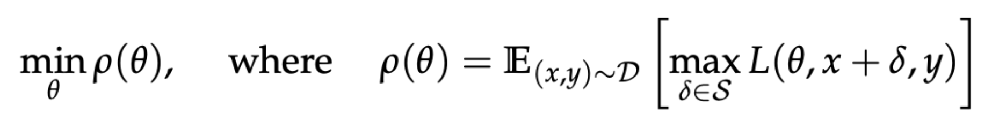
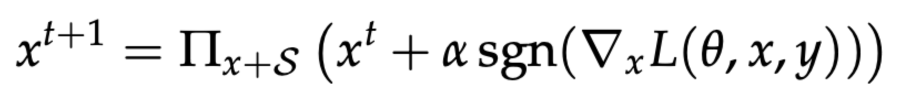
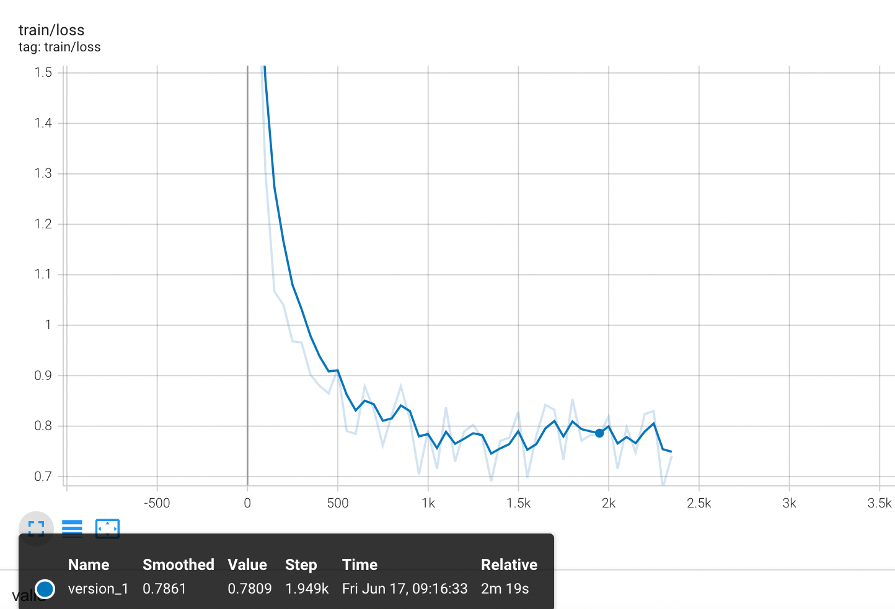
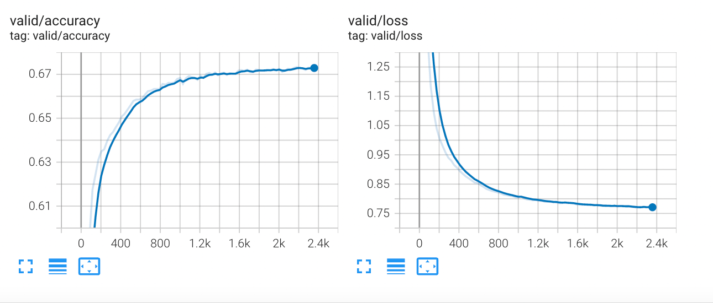
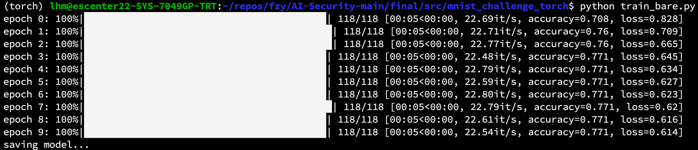
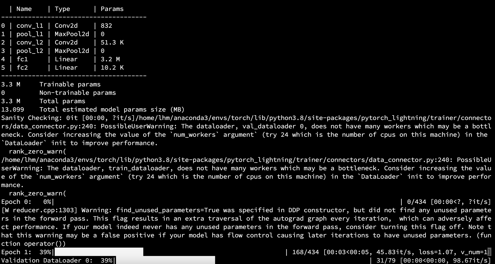
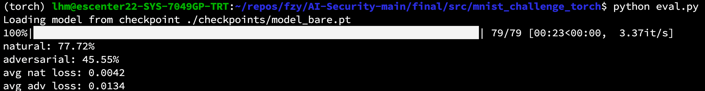
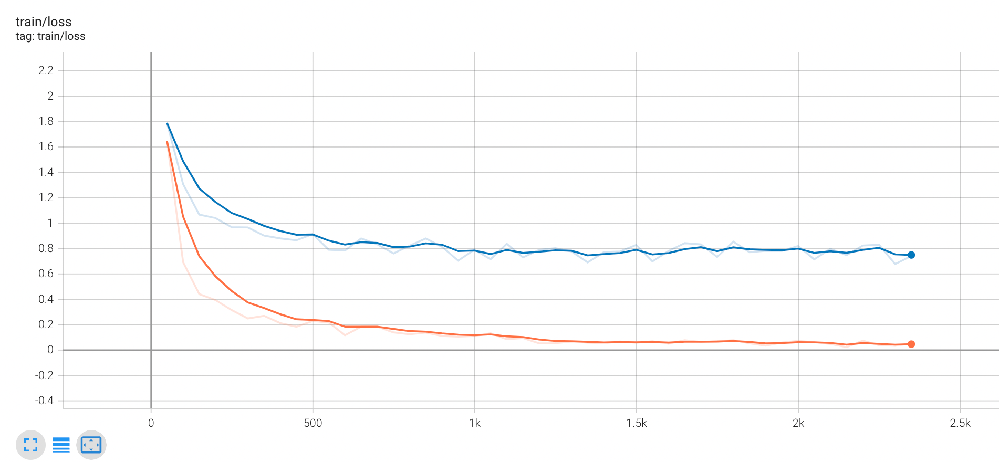
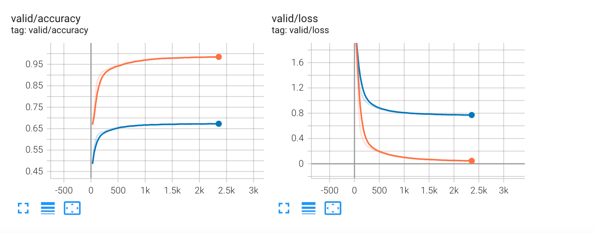

# 人工智能安全大作业 -- 对抗攻防
小组成员：

**范钊瑀 3190105838**  
**向柯蓉 319010**
## 实验设计
本次实验利用`PyTorch`复现了`Towards Deep Learning Models Resistant to Adversarial Attacks`文章中提到的白盒攻击方法，在`MNIST`数据集上进行了测试，证明了利用`PGD`生成对抗样本的可行性，并探究了`PGD`攻击时的参数与攻击效果的关系。

论文中提到的的攻击代码: https://github.com/MadryLab/mnist_challenge (使用`TensorFlow`实现)

## 算法描述

目标描述



*θ*：模型参数

L：损失函数

*δ*：扰动

S：允许的扰动范围

寻找模型参数θ最小化期待的最大损失


攻击——内部最大化损失问题 

防御——外部最小化期待问题

我们的任务为生成对抗攻击样本，采用**projected gradient descent (PGD)**的多步方法



代码实现：
`LinfPGDAttack`类中的`self.rand`变量决定了对抗样本的初识值是有已有样本还是由随机数生成，在指定迭代次数`k`之后，由于我们实施的是白盒攻击，对于每一次迭代，先求得正向传播的梯度，将梯度加到原样本上，并对得到结果的上下限进行限定，以保证结果的正确性。
在返回之前，利用`torch.clamp`函数保证了每一个像素点的攻击结果均仍在合法的范围内。

```python
    def perturb(self, x_nat, y):
        """Given a set of examples (x_nat, y), returns a set of adversarial
           examples within epsilon of x_nat in l_infinity norm."""
        if self.rand:
            x = x_nat + torch.Tensor(x_nat.shape).uniform_(-self.epsilon, self.epsilon).to(device)
            x = torch.clamp(x, 0, 1)  # ensure valid pixel range
        else:
            x = x_nat.clone()

        for i in range(self.k):
            x = Variable(x.float(), requires_grad=True)
            x = x.to(device)
            loss, num_correct, accuracy = self.model(x, y)
            grad = torch.autograd.grad(loss, x)[0]
            x1 = self.a * torch.sign(grad) + x
            x2 = torch.where(x1 > x_nat + self.epsilon, x_nat + self.epsilon, x1)
            x2 = torch.where(x2 < x_nat - self.epsilon, x_nat - self.epsilon, x2)
            x3 = torch.clamp(x2, 0, 1)  # ensure valid pixel range
```

## 关键实验代码分析

### 文件结构

```
.
├── README.md
├── checkpoints
├── config.json
├── eval.py
├── eval_logs
├── eval_pl.py
├── lightning_logs
├── mnist
├── model_bare.py
├── model_pl.py
├── optuna_pl.py
├── pgd_attack.py
├── pgd_attack_pl.py
├── requirements.txt
├── train_bare.py
├── train_pl.py
└── utils.py
```

> train_bare.py 原生PyTorch训练脚本 train_pl.py pytorch-lightning训练脚本
> 
> model_bare.py model_pl.py 模型
>
> pgd_attack.py pgd_attack_pl.py 生成对抗样本
>
> eval.py eval_pl.py 评估对抗样本对正常训练模型进行白盒攻击的成功率
>
> config.json 配置文件，包含epsilon
> 
> utils.py 初始化数据集 & 设置checkpoint

### 训练过程

我们进行了`10`个epoch的训练，由于模型规模较小，可以通过loss和acc的变化确定模型已经收敛，在训练过程中，每经过25%的epoch便会使用`MNIST`提供的测试集进行一次test，并将test得到的结果绘制成图。
训练过程中loss:



在训练的同时，会进行test，过程中得到的loss和acc，由于模型较为简单，acc并没有得到很高的结果:


训练log记录:



此外，基于利用`pytorch-lightning`包装的模型，我们使用lightning提供的`trainer`进行重构，以便在多卡集群上进行训练和验证。默认情况下已使用了`Distributed Data Parallel`策略

利用`pytorch-lightning`的训练log:



训练部分使用lightning的代码实现如下:

```python
trainer = pl.Trainer(max_epochs=10,
                     accelerator="gpu" if torch.cuda.is_available() else None,
                     fast_dev_run=False,
                     gpus=-1 if torch.cuda.is_available() else 0,
                     val_check_interval=0.25,
                     callbacks=[checkpoint_callback],
                     )
trainer.fit(model=model, train_dataloaders=train_loader, val_dataloaders=test_loader)
```

### 模型结构
整体的模型结构复现了论文中的MNIST数据集图片分类模型结构。
整体的模型结构分为两层卷积层，一层全连接层和一层输出层。卷积层中分为卷积和池化两步操作。
卷积层核的大小我们参考了原论文中的数据`(5, 5)`，步长为1，池化层核的大小为`(2, 2)`。

为了适应batch训练，在送入第一层卷积层之前，我们需要对图片的像素进行重新排列，将其转化为`[ batch_size, 1, height, width ]`的形式，第二个维度`1`便为卷积层的`in_channels`

为了保证图片大小在卷积后不变，卷积层中同样有padding。在经过了两层卷积层之后，网络利用全连接层将特征维度扩展到1024，最后一层输出层将特征维度恢复到分类标签的个数10。

下面是我们利用原生`PyTorch`实现的模型结构
```python
class Model(nn.Module):
    def __init__(self):
        super().__init__()
        # first convolutional layer
        self.conv_l1 = nn.Conv2d(in_channels=1,
                                 out_channels=32,
                                 kernel_size=(5, 5),
                                 stride=(1, 1),
                                 padding=2,
                                 bias=True,
                                 padding_mode='replicate')
        self.pool_l1 = nn.MaxPool2d(kernel_size=(2, 2), stride=(2, 2))

        # second convolutional layer

        self.conv_l2 = nn.Conv2d(in_channels=32,
                                 out_channels=64,
                                 kernel_size=(5, 5),
                                 stride=(1, 1),
                                 padding=2,
                                 bias=True,
                                 padding_mode='replicate')
        self.pool_l2 = nn.MaxPool2d(kernel_size=(2, 2), stride=(2, 2))

        # first fully connected layer
        self.fc1 = nn.Linear(in_features=7 * 7 * 64, out_features=1024, bias=True)

        # output layer
        self.fc2 = nn.Linear(in_features=1024, out_features=10, bias=True)


    def forward(self, x_input, y_input):
        x_image = x_input.view(-1, 1, 28, 28)
        h_conv1 = F.relu(self.conv_l1(x_image))
        h_pool1 = self.pool_l1(h_conv1)
        h_conv2 = F.relu(self.conv_l2(h_pool1))
        h_pool2 = self.pool_l2(h_conv2)
        h_pool2_flat = h_pool2.view(-1, 7 * 7 * 64)
        h_fc1 = F.relu(self.fc1(h_pool2_flat))
        h_fc2 = F.relu(self.fc2(h_fc1))
        loss = F.cross_entropy(h_fc2, y_input)
        xent = loss.sum()
        y_pred = torch.argmax(h_fc2, 1)
        correct_prediction = torch.eq(y_pred, y_input)
        num_correct = torch.sum(correct_prediction.long())
        accuracy = torch.mean(correct_prediction.float())
        return loss, num_correct, accuracy
```

### PGD攻击
#### `class LinfPGDAttack`
定义了一个 `LinfPGDAttack` 类，函数 `perturb` 使用前面所提到的算法产生对抗样本。

可以在配置文件的`random_start`参数中设置是否给原始样本添加任意扰动后，再开始进行梯度下降。

#### `pgd_attack_*.py` 中的 `__main__`
默认情况下，在main函数中，如果直接运行`pgd_attack.py`文件，会利用定义好的PGD类，基于`MNIST`提供的test数据集以生成对抗样本，并将对抗样本保存到numpy的输出`.npy`文件中。

#### 攻击测试
我们以  `"epsilon": 0.3, "k": 100, "a": 0.08` 的参数对测试集进行攻击，得到的攻击结果如下：


并且此时的数字仍可被人眼轻松识别，如下图为数字7的对抗样本：


下图为数字3的对抗样本:


### Evaluation

在测试过程中，我们先将预先保存好的模型加载进来，之后按照batch来进行测试，对于每个batch，记录正确的样本个数与总样本个数，在经历了整个test数据集后进行验证，得到训练好的模型在原数据集和对抗样本上的正确率。


正常样本 vs 对抗样本

```python
loss_nat, num_correct_nat, accuracy_nat = model(x_batch, y_batch)
loss_adv, num_correct_adv, accuracy_adv = model(x_batch_adv, y_batch_adv)
```

```python
avg_xent_nat = total_xent_nat / num_eval_examples
avg_xent_adv = total_xent_adv / num_eval_examples

acc_nat = total_corr_nat / num_eval_examples
acc_adv = total_corr_adv / num_eval_examples
```

## 实验结果分析

## 
作acc_adv ~ epsilon图

作acc_adv ~ k图

作acc_adv ~ a图


## 实验总结与思考

### 1.对抗样本生成
在对抗样本生成的过程中，改变控制像素最大偏移比例、攻击轮数等参数会对最终的攻击效果有较大影响，在真正的科研工作中，如果能够找到在合理范围之内的扰动并能使得模型性能显著下降的攻击参数，往往是更重要的事情。

### 2.PyTorch与TensorFlow
复现的过程中，我们参考了原论文中提出的`TensorFlow`代码实现，同样的函数在不同的框架中有不同的用法与不同的参数，例如在卷积过程中，两个框架对`Tensor`维度的定义便不同，再例如，在求梯度过程中两个框架利用到的函数也不同。

此外，在不同版本的PyTorch之间，也有函数实现的差异，例如`torch.clamp`在`1.8`版本和之前传入的上下界参数只能为标量，如果传入`Tensor`则会报错，所以在我们的代码中使用了`torch.where`进行代替。
不过在`1.10`和之后的`PyTorch`中，`torch.clamp`支持了传入`Tensor`作为上下界的参数，方便了我们的编码。

### 3.初始化随机种子
由于我们的模型较为简单，每次参数随机初始化的过程中会对最终收敛时的accuracy和loss有较大的影响，为了保证训练的可复现性，我们在`utils.py`中定义了`setup_seed`函数，用于固定各种随机种子。
```python
def setup_seed(seed):
     torch.manual_seed(seed)
     torch.cuda.manual_seed_all(seed)
     np.random.seed(seed)
     random.seed(seed)
     torch.backends.cudnn.deterministic = True
```
这里附上如果不固定种子的两次训练收敛结果，可以看到两次训练的收敛位置有较大差异，accuracy和loss也有较大差距。






### 4.GPU训练与框架选择
在训练的过程中，由于模型参数量较大，使用CPU进行训练会十分消耗资源，并且不能达到理想的训练速度，为了提高训练速度，我们选择将模型和数据发送到GPU上进行训练，此外，为了提高攻击时的数据计算速度，我们采用`PyTorch`的运算函数重构了原本论文中由`numpy`完成的攻击过程，使得计算能够在GPU上进行。
这样也一定程度上提高了数据计算的速度。

此外，对于多卡集群，我们利用`pytorch-lightning`实现了`Distributed Data Parallel`，提高了多卡并行的效率。