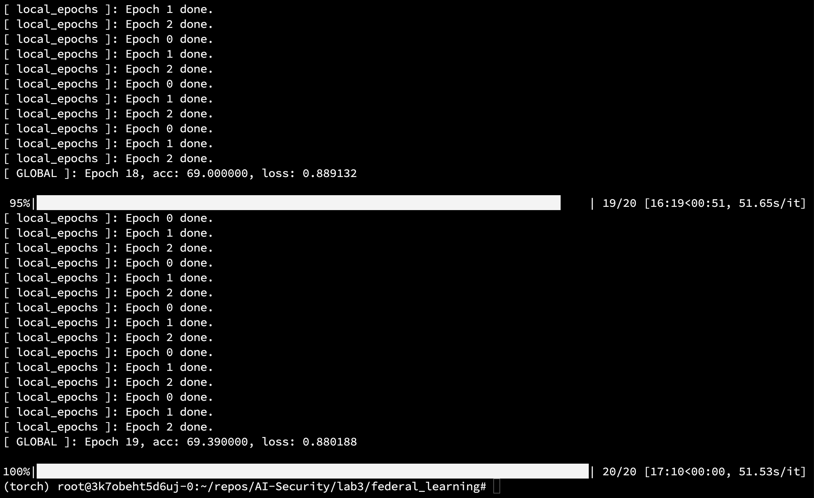

# 第三次上机作业

姓名：范钊瑀

学号：3190105838

## 1.代码流程分析

在整个的项目中，主要包含有以下几部分内容，这部分中我将会结合自己的理解和实验指导中的说明来对代码流程进行分析。

### `main.py`

主程序入口`main.py`函数，用于读取配置文件，划分数据集，创建服务端和客户端实例并调用各自进行训练，此外还要负责模型聚合的过程

开始部分为训练的预准备阶段，在这个阶段中，主程序利用`argparse`模块解析命令行参数，包含了配置文件的路径，再从配置文件中读出模型训练相关参数，以供后续使用。

除外，这个阶段中我们也利用了`get_dataset`函数来从文件中读取数据集，由于数据集特性，我们在读取的时候会读到训练集和验证集，后续只需要将训练集传递到客户端的模型中以供训练。
```python
    parser = argparse.ArgumentParser(description='Federated Learning')
    parser.add_argument('-c', '--conf', dest='conf')
    args = parser.parse_args()

    with open(args.conf, 'r') as f:
        conf = json.load(f)

    train_datasets, eval_datasets = datasets.get_dataset("./data/", conf["type"])
```

在main函数中同样也要实例化`Server`和`Clients`的列表，配置文件中的`no_models`变量存放了`clients`列表中的客户端模型数量。
```python
    server = Server(conf, eval_datasets)
    clients = []

    for c in range(conf["no_models"]):
        clients.append(Client(conf, server.global_model, train_datasets, c))

    print("\n\n")
```

再利用配置文件中定义的`global_epochs`变量，得到全局的epoch论数，每个global循环中，需要随机抽取`k`个客户端，作为本轮迭代中为梯度做贡献的样本，当每一轮结束的时候，会调用server中定义的聚合函数，以更新Server模型中的参数，并进行预测，将本轮中的训练acc打印出来。
```python
    for e in range(conf["global_epochs"]):

        candidates = random.sample(clients, conf["k"])

        weight_accumulator = {}

        for name, params in server.global_model.state_dict().items():
            weight_accumulator[name] = torch.zeros_like(params)

        for c in candidates:
            diff = c.local_train(server.global_model)

            for name, params in server.global_model.state_dict().items():
                weight_accumulator[name].add_(diff[name])

        server.model_aggregate(weight_accumulator)

        acc, loss = server.model_eval()

        print("[ GLOBAL ]: Epoch %d, acc: %f, loss: %f\n" % (e, acc, loss))
```

### `server.py`

服务端类`server.py`，用于初始化全局的`global model`和用于测试的`DataLoader`，其中也包含了训练本地模型的方法


```python
class Server(object):

    def __init__(self, conf, eval_dataset):

        self.conf = conf

        self.global_model = models.get_model(self.conf["model_name"])

        self.eval_loader = torch.utils.data.DataLoader(eval_dataset, batch_size=self.conf["batch_size"], shuffle=True)
```

服务端需要负责模型的聚合，也就是在一轮训练结束后将得到的累计梯度进行汇总并更新模型参数。
```python

    def model_aggregate(self, weight_accumulator):
        for name, data in self.global_model.state_dict().items():

            update_per_layer = weight_accumulator[name] * self.conf["lambda"]

            if data.type() != update_per_layer.type():
                data.add_(update_per_layer.to(torch.int64))
            else:
                data.add_(update_per_layer)
```

在每一轮全局训练结束后，需要对模型进行评测，因此在Server服务端中定义了如下的衡量函数，用于计算模型的acc和loss，其中模型的loss采用交叉熵函数衡量。
由于每一次batch的数据在传播的过程都会产生梯度的累计，这里将最终的数据量按`dataset_size`划分，避免了由于训练数据集过大而堆叠的loss过多。
```python
    def model_eval(self):
        self.global_model.eval()

        total_loss = 0.0
        correct = 0
        dataset_size = 0
        for batch_id, batch in enumerate(self.eval_loader):
            data, target = batch
            dataset_size += data.size()[0]

            if torch.cuda.is_available():
                data = data.cuda()
                target = target.cuda()

            output = self.global_model(data)

            total_loss += torch.nn.functional.cross_entropy(output, target,
                                                            reduction='sum').item()  # sum up batch loss
            pred = output.data.max(1)[1]  # get the index of the max log-probability
            correct += pred.eq(target.data.view_as(pred)).cpu().sum().item()

        acc = 100.0 * (float(correct) / float(dataset_size))
        total_l = total_loss / dataset_size

        return acc, total_l


```

### `client.py`

客户端类`client.py`，用于初始化本地的`local model`和用于训练的`DataLoader`

在运行起主程序之后，主程序会先初始化一个Server实例和一个Client列表，之后对于每个全局的epoch，服务端会随机选择一些客户端作为当前一轮训练的实例，调用每个实例进行训练，在结束时将这些训练的参数结果进行聚合。

客户端需要创建许多个实例，共同聚合起来以供联邦训练的实施。在每个客户端实例中，都会拥有配置文件`conf`， 模型`local_model`， 序号`id`， 训练数据集，以及训练用的`train_loader`。
`data_len`是将训练集分散在每个`Client`的model上之后的结果，所以训练数据集需要通过`id`的下标进行分割。

```python

class Client(object):

    def __init__(self, conf, model, train_dataset, id=-1):

        self.conf = conf

        self.local_model = models.get_model(self.conf["model_name"])

        self.client_id = id

        self.train_dataset = train_dataset

        all_range = list(range(len(self.train_dataset)))
        data_len = int(len(self.train_dataset) / self.conf['no_models'])
        train_indices = all_range[id * data_len: (id + 1) * data_len]

        self.train_loader = torch.utils.data.DataLoader(self.train_dataset, batch_size=conf["batch_size"],
                                                        sampler=torch.utils.data.sampler.SubsetRandomSampler(
                                                            train_indices))
```

这一部分定义了`client`部分的模型自身训练的过程，在训练开始前，`local_train`接收了一个此时的全局模型，并将参数复制到本地的`local_model`中，之后的训练过程便是从`dataloader`中拿取数据，依次送入到本地模型并进行反向传播，这里采用了`SGD`优化器。
在训练结束的时候需要记录本次传播而导致的参数变化，存储在`diff`变量中并返回给`server`，以用来聚合。

```python

    def local_train(self, model):

        for name, param in model.state_dict().items():
            self.local_model.state_dict()[name].copy_(param.clone())

        # print(id(model))
        optimizer = torch.optim.SGD(self.local_model.parameters(), lr=self.conf['lr'],
                                    momentum=self.conf['momentum'])
        # print(id(self.local_model))
        self.local_model.train()
        for e in range(self.conf["local_epochs"]):

            for batch_id, batch in enumerate(tqdm(self.train_loader)):
                data, target = batch

                if torch.cuda.is_available():
                    data = data.cuda()
                    target = target.cuda()

                optimizer.zero_grad()
                output = self.local_model(data)
                loss = torch.nn.functional.cross_entropy(output, target)
                loss.backward()

                optimizer.step()
            print("[ local_epochs ]: Epoch %d done." % e)
        diff = dict()
        for name, data in self.local_model.state_dict().items():
            diff[name] = (data - model.state_dict()[name])
        # print(diff[name])

        return diff
```


## 2.算法实现说明

根据config文件里的配置，整个训练过程中的`global_epochs`为20，代表全局的模型一共有20次梯度的更新，每个epoch中会从总共的`no_models`个server模型中随机挑选k(参数中k=5)个模型进行训练，并将梯度进行汇总，汇总之后传递到Server的模型以供梯度聚合。


## 3.运行结果

在添加了相关输出以后，我们能够更直观地看到local和global的训练过程。在每个Global epoch结束的时候会将聚合的结果汇总并进行梯度更新，可以看到在20个Global epoch结束之后，整体的loss已经能够达到较低的水平，而accuracy也在逐渐增高。




